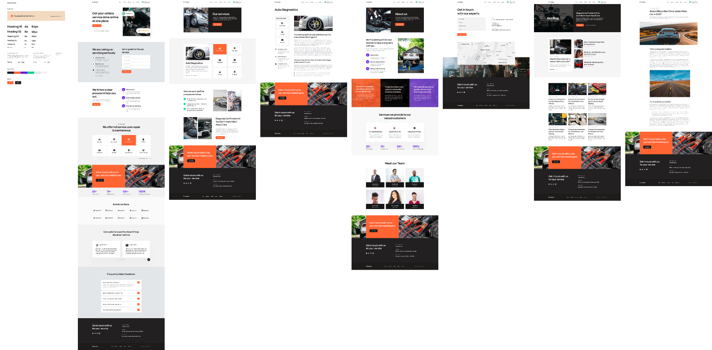

# Car Service Website Clone

This React project is all about recreating a car service website that originally existed as a design in Figma. The main goal here was to copy the website's look and style as closely as possible.

## Project Details

- **Figma Design:** We used a Figma design as our guide to build the website.
- **Styling Challenge:** The big task was to make the website look just like the design, including things like fonts, colors, and spacing.
- **React Magic:** We used React to turn the design into a real website with working buttons and menus.

## What Stands Out

- **Attention to Detail:** We paid extra care to make sure our website looked almost exactly like the design.
- **Works on Any Screen:** The website adjusts itself to look good on both big computer screens and small phone screens.
- **Clickable and Fun:** We added things you can click and interact with to make the website more interesting.

## Tech We Used

- React: A fancy tool to make cool websites.
- Figma: A design tool we used to see what the website should look like.
- HTML & CSS: The basics of how websites are made.

This project shows how we can take a design and turn it into a real website that looks great and works smoothly.

